# Data Source Ecosystem

```mermaid
graph TB
    subgraph "Data Intelligence Platform"
        DC[Data Connectors]
        CM[Connection Manager]
    end

    subgraph "Enterprise Data Sources"
        SF[Snowflake]
        RS[Redshift]
        BQ[BigQuery]
        PG[PostgreSQL]
        OR[Oracle]
    end

    subgraph "Business Applications"
        QB[QuickBooks]
        SH[Shopify]
        SP[Salesforce]
        HB[HubSpot]
        ZH[Zendesk]
        ST[Stripe]
    end

    subgraph "Productivity Tools"
        GS[Google Sheets]
        XL[Excel Online]
        AT[Airtable]
        NT[Notion]
    end

    subgraph "Custom Sources"
        API[REST APIs]
        CSV[CSV Files]
        JSON[JSON Files]
        XML[XML Data]
    end

    DC --> CM
    CM --> SF & RS & BQ & PG & OR
    CM --> QB & SH & SP & HB & ZH & ST
    CM --> GS & XL & AT & NT
    CM --> API & CSV & JSON & XML

    classDef enterprise fill:#2374ab,stroke:#2374ab,stroke-width:2px,color:#fff
    classDef business fill:#ff8c42,stroke:#ff8c42,stroke-width:2px,color:#fff
    classDef productivity fill:#4cb944,stroke:#4cb944,stroke-width:2px,color:#fff
    classDef custom fill:#8c4843,stroke:#8c4843,stroke-width:2px,color:#fff
    classDef platform fill:#6b4e71,stroke:#6b4e71,stroke-width:2px,color:#fff

    class SF,RS,BQ,PG,OR enterprise
    class QB,SH,SP,HB,ZH,ST business
    class GS,XL,AT,NT productivity
    class API,CSV,JSON,XML custom
    class DC,CM platform
```

## Data Source Categories

### Enterprise Data Sources
- Data warehouses (Snowflake, Redshift, BigQuery)
- Relational databases (PostgreSQL, Oracle, SQL Server)
- Data lakes (AWS S3, Azure Data Lake)

### Business Applications
- Financial systems (QuickBooks, Xero, NetSuite)
- E-commerce platforms (Shopify, WooCommerce, Magento)
- CRM systems (Salesforce, HubSpot)
- Support systems (Zendesk, Intercom)
- Payment processors (Stripe, Square)

### Productivity Tools
- Spreadsheets (Google Sheets, Excel Online)
- Databases (Airtable, Notion)
- Collaboration tools (Monday.com, Asana)
- Document management (SharePoint, Google Drive)

### Custom Sources
- REST APIs
- File-based data (CSV, JSON, XML)
- Custom databases
- Legacy systems

## Integration Considerations

### Connection Types
- Native connectors
- API integrations
- File imports
- Custom adapters

### Data Sync Patterns
- Real-time streaming
- Scheduled batch
- Event-driven
- On-demand

### Schema Handling
- Auto-discovery
- Mapping templates
- Custom field mapping
- Relationship inference

### Security & Compliance
- Authentication methods
- Data encryption
- Access controls
- Audit logging

## Business Impact

This comprehensive data source coverage enables:
1. **Complete Business View**: Combine data across all systems
2. **Flexible Integration**: Support for any data source type
3. **Scalable Growth**: Start small, expand as needed
4. **Universal Access**: Query any source through natural language
5. **Unified Context**: Build relationships across all data sources
