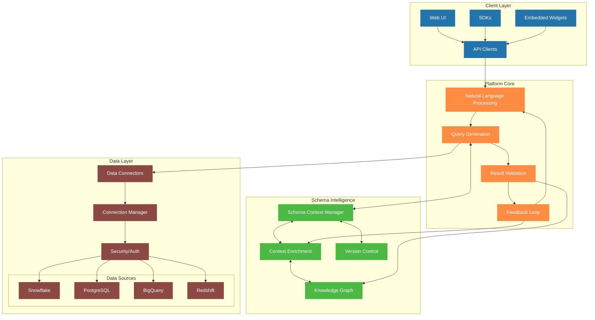

# Platform Architecture

## Component Descriptions

### Client Layer
- **Web UI**: Primary web interface for direct user interaction
- **SDKs**: Development kits for various programming languages
- **API Clients**: Direct API integration points
- **Embedded Widgets**: Embeddable components for third-party applications

### Platform Core
- **Natural Language Processing**: Converts user questions to structured queries
- **Query Generation**: Creates optimized database queries
- **Result Validation**: Ensures quality and relevance of results
- **Feedback Loop**: Captures and processes user interactions

### Schema Intelligence
- **Schema Context Manager**: Maintains and serves schema configurations
- **Context Enrichment**: Enhances schema with business context
- **Version Control**: Manages schema evolution
- **Knowledge Graph**: Builds relationships between data concepts

### Data Layer
- **Data Connectors**: Database-specific integration modules
- **Connection Manager**: Handles database connections
- **Security/Auth**: Manages authentication and authorization
- **Data Sources**: Supported databases (expandable)

## Key Features

1. **Modular Architecture**
   - Independent components
   - Pluggable data sources
   - Extensible processing pipeline

2. **Intelligent Processing**
   - Multi-stage query generation
   - Context-aware processing
   - Learning feedback system

3. **Enterprise Ready**
   - Scalable architecture
   - Security focused
   - Multi-tenant capable

4. **Integration Friendly**
   - Multiple access patterns
   - Standard protocols
   - Flexible deployment options
